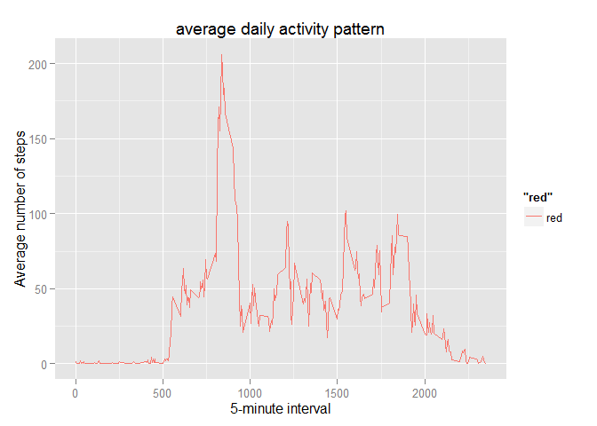

# Reproducible Research: Peer Assessment 1


## Loading and preprocessing the data

1- load the activity data from work directory.


```r
activity <- read.csv("~/activity.csv")
```
2- Process/transform the data (if necessary) into a format suitable for your analysis.


```r
activity$date <- as.Date(activity$date , format = "%Y-%m-%d")
```


## What is mean total number of steps taken per day?

* first of all, we will remove the NA from dataset then aggregate the total step per day.

```r
new_activity_df <- activity[!is.na(activity$steps),] 

agg_steps_day <- sqldf("select 
                       sum(steps) as Total_steps , 
                       date 
                       from new_activity_df 
                       group by date")
```

1- histogram of the total number of steps taken each day


```r
hist(agg_steps_day$Total_steps , 
     main = "Total number of steps taken each day" , 
     xlab = "Total Number of steps",
     col = "red")
```

 

2- Calculate and report the mean and median total number of steps taken per day.

* The mean of total number of steps is 1.0766189\times 10^{4} 
* The median of total number of steps is 10765


## What is the average daily activity pattern?

1- Make a time series plot of the 5-minute interval (x-axis) and the average number of steps taken, averaged across all days (y-axis).


```r
avg_steps_day <- sqldf("select 
                       avg(steps) as Avg_steps , 
                        interval
                       from new_activity_df 
                       group by interval")
```

```r
qplot(avg_steps_day$interval,
      avg_steps_day$Avg_steps,
      geom = "line",
      ylab = "Average number of steps",
      xlab = "5-minute interval",
      main = "average daily activity pattern",
      col = "red")
```

 

2- The 5-minute interval, on average across all the days in the dataset, contains the maximum number of steps is


```r
avg_steps_day[which(avg_steps_day$Avg_steps == max(avg_steps_day$Avg_steps) ) ,]$interval
```

```
## [1] 835
```

## Imputing missing values

1- Calculate and report the total number of missing values in the dataset (i.e. the total number of rows with NAs)


```r
sum(is.na(activity$steps)) + sum(is.na(activity$date)) + sum(is.na(activity$interval)) 
```

```
## [1] 2304
```

2- The strategy for filling in all of the missing values in the dataset is the mean for that 5-minute interval.

3- Create a new dataset that is equal to the original dataset but with the missing data filled in.

```r
final_df <- join(activity,avg_steps_day,by = "interval" , type = "left")

final_df$f_step <- ifelse(is.na(final_df$step), final_df$Avg_steps, final_df$step)

final_df$steps <- final_df$f_step

final_df$f_step <- NULL
```

4- Make a histogram of the total number of steps taken each day. 


```r
total_all_steps_per_day <- sqldf("select 
                       sum(steps) as total_steps , 
                        date
                       from final_df 
                       group by date")
```

```r
hist(total_all_steps_per_day$total_steps , 
     main = "Total number of steps taken each day" , 
     xlab = "Total Number of steps",
     col = "red")
```

 


* Calculate and report the mean and median total number of steps taken per day after impute the missing values

* The mean after imputing the missing values is 1.0766189\times 10^{4}
* The Median after imputing the missing values is 1.0766189\times 10^{4}

* The mean value before and after imputing missing values is the same but there is a little change in the median after imputing the missing values.

* The impact of imputing missing data on the estimates of the total daily number of steps is very minor.

## Are there differences in activity patterns between weekdays and weekends?

1- Create a new factor variable in the dataset with two levels -- "weekday" and "weekend" indicating whether a given date is a weekday or weekend day , weekend is saturday and sunday.


```r
final_df$day_type <- as.factor(ifelse(weekdays(final_df$date) == c("Sunday","Saturday"), 
                            "weekend", "weekday"))
```

2- Make a panel plot containing a time series plot (i.e. type = "l") of the 5-minute interval (x-axis) and the average number of steps taken, averaged across all weekday days or weekend days (y-axis).


```r
avg_steps_day_n <- sqldf("select 
                       avg(steps) as Avg_steps , 
                        interval,
                        day_type
                       from final_df 
                       group by interval,day_type")


xyplot( Avg_steps ~ interval | day_type, 
        data = avg_steps_day_n , type = "l" , aspect = 1/2)
```

 


* as per previuos graph, Yes, there is a differences in activity patterns between weekdays and weekends, weekends show more activity than weekday.
